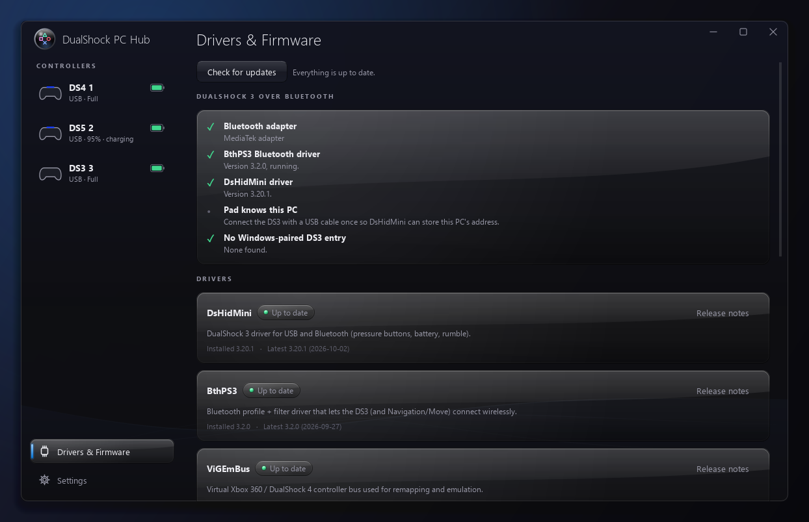
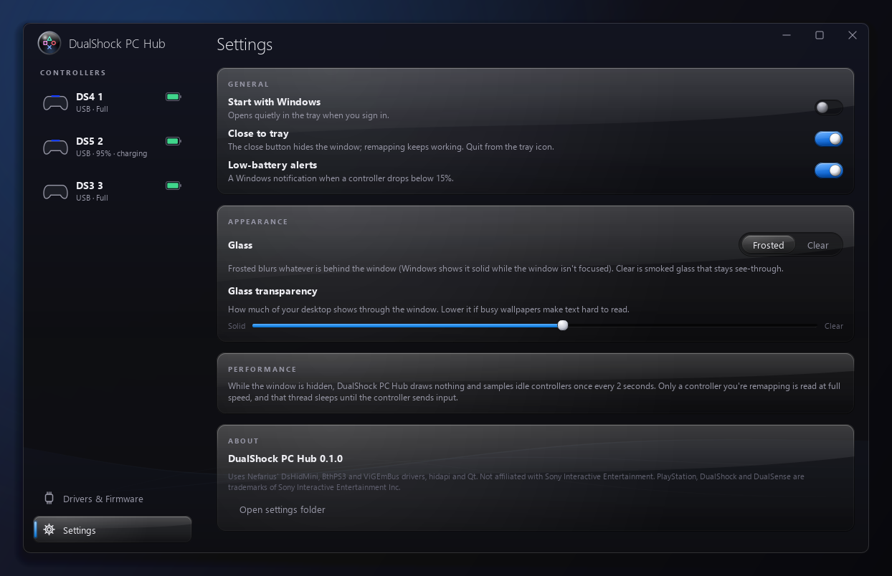

# DualShock PC Hub

**Get any PlayStation controller working on your Windows PC.** DualShock PC Hub makes setting up PlayStation controllers on a PC easy. It shows which drivers your PC is missing and installs the official ones with one click. Then you can see, test and remap every connected controller.

<!-- Demo video: open this file in GitHub's editor and drag the .mp4 onto this line. GitHub uploads it and turns the link into a player. -->

| Drivers & Firmware | Settings |
|---|---|
| [](docs/images/drivers.png) | [](docs/images/settings.png) |

## Supported controllers

| Controller | USB | Bluetooth | Needs |
|---|---|---|---|
| DualSense | ✅ | ✅ | Nothing |
| DualShock 4 (v1 and v2) | ✅ | ✅ | Nothing |
| DualShock 3 / SIXAXIS | ✅ | ✅ | [DsHidMini](https://github.com/nefarius/DsHidMini), plus [BthPS3](https://github.com/nefarius/BthPS3) for Bluetooth. The app installs both. |
| DualSense Edge **(beta)** | ✅ | ✅ | Nothing |
| DualShock 2 **(beta)** | ✅ through a PS2-to-USB adapter | — | Nothing |

## Download

1. Open [**Releases**](https://github.com/AndreJSLC/DualShockPCHub/releases/latest) and download `DualShockPCHub-v0.1.0-win64.zip`.
2. Right-click the zip and choose **Extract All**. The app won't run from inside the zip.
3. Open the extracted folder and run **DualShockPCHub.exe**.

> **"Windows protected your PC"?** Windows shows this the first time for apps that aren't code-signed. Click **More info**, then **Run anyway**. All the source code is here if you want to check it or build it yourself.

Then open **Drivers & Firmware**. It lists exactly what your PC is missing.

## Features

- **Driver setup:** see what's installed, outdated or broken. Install the latest official DsHidMini, BthPS3, ViGEmBus and HidHide with one click. Each download is checked against its published SHA‑256 and its publisher's signature.
- **DS3 Bluetooth checklist:** checks the Bluetooth radio, the drivers and the pad's pairing. Each failed step says how to fix it.
- **Conflict detector:** flags DS4Windows, DSX, reWASD, Steam Input, ScpToolkit leftovers, a hijacked Bluetooth adapter and more.
- **Live view:** a clean drawing of your exact controller. Buttons light up, sticks and triggers move, and touchpad fingers show as dots.
- **Battery:** level and charging state, plus a time-to-full and time-left estimate that learns each controller.
- **Stick test:** measures drift, reach, return to centre and connection quality. **Calibrate centre** fixes an off-centre stick.
- **Remapping:** to a virtual Xbox 360 controller (through ViGEmBus), or to keyboard and mouse. Click a button on the drawing to rebind it. Profiles are saved per controller.
- **Lights and rumble:** light bar colour, a rumble test, and a DualSense battery saver.
- **Ultra lightweight:** made to stay open while you play. See [Performance](#performance).

## Setting up each controller

### DualShock 3

1. From the Drivers page, install the **.NET 10 Desktop Runtime** and then **DsHidMini 3.x**. DsHidMini installs over older versions.
2. Plug the DS3 in with a USB cable. It works right away.
3. **For Bluetooth:**
   1. Install **BthPS3**, then reboot. If you're upgrading from BthPS3 2.x, uninstall it and reboot first.
   2. Plug the DS3 in over USB once. DsHidMini saves your PC's Bluetooth address into the pad.
   3. Unplug it and press **PS**.
   4. If it doesn't connect, open the **DS3 Bluetooth setup** checklist in the app.
   - **Never** pair a DS3 through Windows' *Settings → Bluetooth*. If you already did, remove it there.

### DualShock 4, DualSense and DualSense Edge

These work out of the box over USB and Bluetooth. To pair over Bluetooth, hold **Share/Create + PS** until the light flashes, then pair in Windows' Bluetooth settings.

For DualSense and Edge firmware, the Drivers page links Sony's official **PlayStation Accessories** app.

Edge support is in beta: the back buttons and Fn buttons are new. Please [open an issue](https://github.com/AndreJSLC/DualShockPCHub/issues) if something looks wrong.

### DualShock 2 (beta, through a PS2-to-USB adapter)

- **No driver needed.** Plug the adapter in and it's recognised. Two-port adapters show one pad per port.
- **Supported adapters:** Twin USB (0810:0001), most WiseGroup and Mayflash boxes (0925:xxxx and 6666/6677:880x), ShanWan (2563:0575) and other common ones. The full list is in [docs/RESEARCH-ds2-adapters.md](docs/RESEARCH-ds2-adapters.md).
- **Plug the pad in first:** many adapters, including the common Twin USB, only detect a pad when the adapter powers up.
- This support is based on the adapters' published layouts and hasn't been tested on real adapters yet. Please [open an issue](https://github.com/AndreJSLC/DualShockPCHub/issues) if yours misbehaves.

## Troubleshooting

| Problem | Fix |
|---|---|
| A DS3 worked over Bluetooth, but stopped after a Windows update | Windows removed BthPS3's "Bluetooth PS Enumerator". Uninstall BthPS3, reboot, install the latest version, reboot again. The app shows BthPS3 as **broken** when this happens. |
| A pad doesn't show up in the hub | Another app may have it open exclusively (DS4Windows, DSX). If HidHide hides it, add the hub to HidHide's allowed apps. |
| One DS3 shows up twice in Steam | A Steam bug with DsHidMini's XInput mode. Switch the DS3 to **SXS** mode. |
| A DualShock 2 doesn't show up | Unplug the adapter, connect the pad to it, then plug the adapter back in. |
| A stick drifts or feels off-centre | Open Live → **Test sticks…**, run the return-to-centre check, then press **Calibrate centre**. |

The full write-up, with driver versions, sources and HID protocol details, is in [docs/RESEARCH-drivers.md](docs/RESEARCH-drivers.md).

## Performance

The hub is made to sit open next to your games without costing frames.

- **Hidden or in the tray:** nothing is drawn and no timers run. Controllers are only checked occasionally for battery. Plugging and unplugging is detected through Windows events, not polling.
- **Live view open:** the drawing redraws only the part that changed, at most 60 times a second. That's about 1 ms per frame.
- **Remapping:** the only part that runs at the controller's full rate, so input lag stays low.
- **No background network:** driver scans and update checks only run when you open Drivers & Firmware.

| Situation (share of one CPU core) | CPU | Memory |
|---|---|---|
| Hidden in the tray | 0.0–0.2 % | ~8 MB |
| Remapping a DS4 at rest, window hidden | ~0.6 % | — |

## What the app does to your system

- **Scanning is read-only.** It reads the registry, the driver store and the device tree.
- **Nothing is downloaded or installed until you click a button.** Every installer opens its own normal window behind a Windows UAC prompt.
- **Downloads come only from official sources:** the driver projects' GitHub releases, Microsoft and Sony. Each file must match its published SHA‑256 and be signed by the expected publisher, or it isn't run.
- **No firmware is ever flashed by this app.** Firmware updates go through Sony's own tool.
- **Your settings** stay in `%APPDATA%\DualShockPCHub`. There's no telemetry.

## For developers

Running from source needs Python 3.11 or newer:

```powershell
git clone https://github.com/AndreJSLC/DualShockPCHub.git
cd DualShockPCHub
python -m venv .venv
.venv\Scripts\activate
pip install -e .[dev]
python -m dshub                   # run the app
python -m pytest                  # run the tests
python -m dshub.system            # command-line diagnostics: drivers, Bluetooth, DS3 pairing, conflicts
```

**Building the release:**

```powershell
python -m PyInstaller packaging\dshub.spec --noconfirm
Compress-Archive dist\DualShockPCHub DualShockPCHub-v0.1.0-win64.zip
```

- **What the build contains:** a one-folder build, `dist\DualShockPCHub\DualShockPCHub.exe`, with the license texts of everything it bundles in `licenses\`. Only QtCore, QtGui and QtWidgets are included.
- **The exe is also its own admin helper.** It relaunches itself with `--system …` behind UAC for actions that need admin rights.

**Project layout:**

```
dshub/
  core/        HID backends for DS2/DS3/DS4/DualSense, controller state, ViGEmBus client
  mapping/     remap engine, profiles, keyboard and mouse output
  system/      drivers, firmware, DS3 pairing, conflicts (no UI)
  ui/          window, pages, theme, stick test
    flat/      the controller drawings, one module per model
docs/          research notes (drivers, DS2 adapters)
packaging/     PyInstaller spec, icon, launcher, third-party licenses
tests/         test suite
tools/         screenshots, demo video and drawing benchmark
```

**Changing the drawings?** `python tools/bench_flat_view.py snap before`, make your change, `snap after`, then `diff before after` checks that the look at rest stays pixel-identical. The drawings are this project's own work, in the style of the controller diagrams in PCSX2 and RPCS3.

## Credits

- **[Nefarius Software Solutions](https://github.com/nefarius)** for DsHidMini, BthPS3, ViGEmBus and HidHide. None of this would work on Windows without them.
- The Linux `hid-sony` and `hid-playstation` drivers, for the best public documentation of the controllers' HID reports.
- [hidapi](https://github.com/trezor/cython-hidapi) and [Qt for Python](https://doc.qt.io/qtforpython-6/).

## Disclaimer

This is an independent project. It is not affiliated with or endorsed by Sony Interactive Entertainment. "PlayStation", "DualShock" and "DualSense" are trademarks of Sony Interactive Entertainment Inc. Drivers are installed from their official releases under their own licenses.

## License

[MIT](LICENSE). The Windows download also includes third-party software under its own licenses; see `licenses\THIRD-PARTY-NOTICES.txt` in the download.
